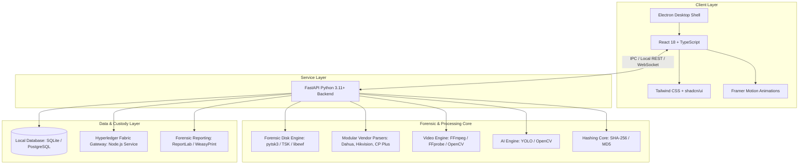

# Drishtik: Multi-Vendor DVR/NVR Forensic Analysis Platform

---

## Overview

**Drishtik** is a specialized local desktop forensic analysis application engineered for the authorized acquisition, examination, recovery, and verification of digital surveillance evidence from multi-vendor DVR (Digital Video Recorder) and NVR (Network Video Recorder) systems.

Designed for digital forensic investigators, law enforcement analysts, and incident response professionals, Drishtik delivers a forensic workstation experience inspired by professional media organization workflows while maintaining zero-alteration evidence handling, cryptographic chain-of-custody verification, and modular vendor filesystem parsing.

---

## Problem Statement

Surveillance video evidence recovery is fraught with technical hurdles that challenge conventional computer forensics tools:

1. **Proprietary & Undocumented Filesystems**: Major surveillance manufacturers (e.g., Dahua DHFS, Hikvision HIKFS, CP Plus) utilize custom partition layouts and unindexed block allocations that are unreadable by standard operating systems.
2. **Stream Interleaving & Fragmentation**: Multi-channel video streams are frequently written in interleaved or proprietary container formats (`.dav`, custom elementary H.264/H.265 streams), causing frame loss or synchronization errors in standard media players.
3. **Corrupted & Deleted Storage Sectors**: Power cuts, disk overwrites, and intentional tampering require specialized unallocated space carving and frame-header recovery rather than standard file undelete utilities.
4. **Asynchronous Multi-Camera Timelines**: Clock drift across unsynchronized channels complicates chronological event reconstruction across multiple vantage points.
5. **Chain of Custody & Evidence Tampering Risks**: Using non-forensic media tools risks modifying file metadata or access timestamps, jeopardizing judicial admissibility.

---

## Current Status

**Phase 1: Repository Foundation**

The repository is currently in its initial scaffolding and architectural planning phase. Core project structures, forensic governance rules, security baseline guidelines, and preliminary system architectures are established. No active forensic algorithms, parsers, or video decoding routines have been implemented at this stage.

---

## Local-First Processing Architecture

Drishtik operates strictly under a **Local-First Processing Model**:

- **Complete Air-Gapped Operation**: All acquisition, disk image mounting, stream demuxing, metadata extraction, AI inference, and hash calculations are executed entirely on the local forensic workstation.
- **Zero Cloud Transmission**: No surveillance media, telemetry, investigator identity data, or forensic artifacts are transmitted to external servers or cloud providers.
- **Hardware Write-Blocking Compatibility**: Designed to interface with physical write-blockers and read-only raw disk images (`.dd`, `.raw`, `.E01`) without altering evidence drive sectors.

---

## Planned Major Modules

Drishtik is organized into distinct, modular functional engines:

| Module | Responsibility |
| :--- | :--- |
| **`forensic_engine/`** | Manages physical device mounting, forensic disk image loading, sector acquisition, and low-level disk access. |
| **`parsers/`** | Modular adapters for proprietary DVR/NVR filesystems (Dahua, Hikvision, CP Plus, Uniview, Godrej, Honeywell, Matrix, etc.). |
| **`recovery/`** | Carves deleted video frames, unallocated clusters, orphaned index headers, and fragmented stream segments. |
| **`video_engine/`** | Multi-channel stream demuxing, decoding (FFmpeg/OpenCV), frame extraction, and non-destructive playback. |
| **`ai_engine/`** | Local AI-assisted object detection, person/vehicle categorization, and motion detection without altering source metadata. |
| **`hashing/`** | Cryptographic verification engine computing primary SHA-256 hashes and optional secondary MD5 reference hashes. |
| **`timeline/`** | Multi-camera chronological event alignment, timestamp normalization, and multi-angle synchronized event tracking. |
| **`blockchain/`** | Hyperledger Fabric ledger integration recording tamper-evident audit logs and custody transfer proofs. |
| **`database/`** | Local case database (SQLite initial / PostgreSQL scalable) managing case metadata, annotations, and investigator records. |
| **`security/`** | Role-Based Access Control (Admin, Investigator, Viewer), individual credential management, and audit logging. |
| **`reports/`** | Comprehensive forensic report generator (PDF export via ReportLab/WeasyPrint) including hashes and findings. |
| **`frontend/`** | Professional, high-efficiency desktop UI built on Electron, React, TypeScript, and Tailwind CSS. |
| **`backend/`** | High-performance Python backend powered by FastAPI handling asynchronous forensic workloads. |

---

## Target Vendor Support

### Initial Target Vendors
- **Dahua** (DHFS, `.dav` stream structures)
- **Hikvision** (HIKFS, MP4/HIK container layouts)
- **CP Plus** (CP Plus proprietary DVR file allocations)

### Planned Future Vendors
- **Uniview**
- **Godrej**
- **Honeywell**
- **Matrix**
- **TP-Link**
- Other standard surveillance platforms

---

## Planned Technology Stack

---

## Planned Development Phases

1. **Phase 1: Repository Foundation** *(Current)*
   - Directory structure, development rules, security boundaries, and architectural baselines.
2. **Phase 2: Ingestion & Modular Parsers**
   - Device detection, forensic image ingestion, initial Dahua/Hikvision/CP Plus filesystem parsers.
3. **Phase 3: Video Engine & Chronological Timeline**
   - Stream decoding, multi-channel timestamp normalization, synchronized playback workspace.
4. **Phase 4: Carving, Recovery & AI Detection**
   - Unallocated sector carving, deleted segment reconstruction, local YOLO-based object detection.
5. **Phase 5: Blockchain Custody & RBAC Security**
   - Hyperledger Fabric custody ledger integration, case-level collaborator access control (Admin, Investigator, Viewer).
6. **Phase 6: Forensic Reporting & Verification**
   - Comprehensive court-admissible PDF generation, end-to-end integration tests, and security audits.

---

## Forensic Integrity Standards & Vendor Support Policy

> [!IMPORTANT]
> **Strict Forensic Truthfulness Principle**:
> Drishtik strictly forbids the fabrication, interpolation, or silent guessing of unsupported or corrupt surveillance data formats.
> If a vendor format, filesystem variant, or codec is unverified or unsupported, Drishtik **MUST explicitly report an unsupported status** to the examiner.
> Unsupported formats will never be falsely presented as supported or parsed with speculative heuristics.

---

## Authorized-Use Disclaimer

> [!CAUTION]
> **LEGAL NOTICE & AUTHORIZED USE ONLY**
>
> Drishtik is a digital forensic analysis software platform created exclusively for authorized law enforcement personnel, licensed digital forensic examiners, and legal practitioners operating under legal authority, judicial warrants, or explicit authorization of the evidence owner.
>
> Unauthorized interception, extraction, decryption, or tampering with surveillance footage or digital recording systems is strictly prohibited under domestic and international cyber and privacy laws. Developers and contributors assume no liability for misuse of this software.
