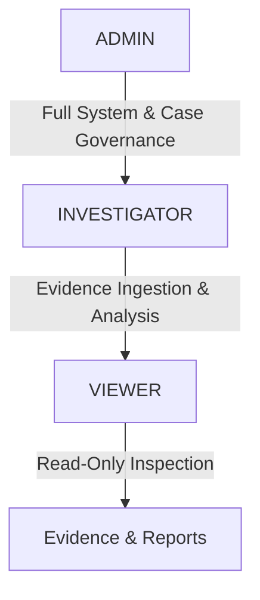

# Drishtik: Architecture & Technical Specifications

This document outlines the preliminary technical architecture, subsystem design, data models, authentication structures, and user interface concepts for the **Drishtik** forensic analysis platform.

---

## Preliminary Technology Stack

| Layer | Technologies | Rationale & Scope |
| :--- | :--- | :--- |
| **Desktop Shell** | **Electron** | Cross-platform desktop runtime enabling native OS window management, hardware access, and local file handling. |
| **Frontend UI** | **React + TypeScript**, **Tailwind CSS**, **shadcn/ui**, **Framer Motion** | High-performance, type-safe interface components, modular design tokens, accessible components, and subtle micro-transitions. |
| **Backend Service** | **Python + FastAPI** | Asynchronous REST and WebSocket API service orchestrating forensic pipelines, disk access, and worker tasks. |
| **Database** | **SQLite** (initial), **PostgreSQL** (scalable option) | Zero-configuration local database for individual workstations, with migration path to PostgreSQL for enterprise deployments. |
| **Forensic Core** | **The Sleuth Kit (TSK)**, **pytsk3**, **libewf** (where appropriate) | Low-level filesystem examination, disk partition analysis, Expert Witness (`.E01`) image parsing, and raw sector access. |
| **Video Engine** | **FFmpeg**, **FFprobe**, **OpenCV** | Demuxing, decoding, frame extraction, stream verification, and container conversions without re-encoding original streams. |
| **AI Engine** | **YOLO**, **OpenCV** | Local object detection (persons, vehicles), motion estimation, and visual search without external API dependencies. |
| **Integrity & Hashing** | **SHA-256** (Primary), **MD5** (Reference hash) | Cryptographic verification of evidence files, carved frames, and audit records. |
| **Blockchain Custody** | **Hyperledger Fabric**, **Node.js Fabric Gateway** | Enterprise permissioned ledger recording immutable custody transitions and cryptographic audit logs. |
| **Forensic Reporting** | **ReportLab** or **WeasyPrint** | Programmatic generation of court-admissible, structured forensic PDF reports. |

---

## Authentication & Role-Based Access Control (RBAC) Model

> [!IMPORTANT]
> **Authentication is NOT to be implemented during Phase 1.** This specification defines the planned security architecture.

### User Identity Invariants
- Every user must have a **unique username**, a **unique password**, and an **assigned role**.
- Shared or generic team accounts (e.g., sharing a single password among investigators) are strictly prohibited.

### Role Hierarchy


- **ADMIN**:
  - Full administrative ownership over cases and configuration.
  - Adds, manages, and removes case collaborators.
  - Manages global security settings and blockchain node connections.
- **INVESTIGATOR**:
  - Ingests devices and forensic images.
  - Executes parsers, recovery carving, and video analysis.
  - Annotates evidence and compiles draft reports.
- **VIEWER**:
  - Read-only access to ingested evidence, timeline visualizer, and finalized reports.
  - Cannot modify case metadata, trigger ingestion, or alter annotations.

### Case Access Model
- An **Admin** owns and manages the case.
- The Admin can invite individual collaborators to a case.
- Collaborators receive individual **Investigator** or **Viewer** roles on a per-case basis.
- Every collaborator authenticates with their individual account credentials.
- All role permissions are enforced directly by the backend API at the route and service levels.

---

## Forensic Evidence & Data Models

### Evidence Hierarchy
```
Device
 └── Acquisition
      └── Evidence
           └── Video / Image / Metadata
```

### Device Concept
A **Device** represents the physical or virtual origin of surveillance media, including:
- Physical DVR units
- Physical NVR units
- Internal DVR/NVR hard disk drives (raw/unformatted by standard OS)
- External storage media (USB drives, SD cards)
- Forensic disk images (`.dd`, `.raw`, `.img`, `.E01`)

---

## UI / UX Architecture & Workspace Concepts

### 1. Application-Level Navigation
- **Case Manager**: Top-level entry point to create new cases or select an existing case.
- **Case Authentication**: Upon selecting a case, the user authenticates with their individual credentials, and backend RBAC assigns active session permissions.

---

### 2. Case Dashboard Concept
- **No Cases Section inside the Dashboard**: The active case dashboard represents the selected case only; switching cases occurs via the Case Manager.
- **No "Recent Activity" Stream**: Avoid noisy, non-forensic activity feeds.
- **Recent Evidence Preview**: A concise, focused preview card showing recently ingested evidence.
- **Minimal Summary Cards**: Clean, high-impact case statistics (e.g., total devices, ingested streams, verified hashes, recovered items).

---

### 3. Evidence Workspace Concept
- **Card & Grid Layout**: Ingested files and extracted clips are displayed in structured cards and table grids.
- **Evidence Card Data**:
  - Evidence ID
  - File Name
  - Source Device / Channel
  - Media Type / Codec
  - File Size
  - Hash Status (Verified / Mismatch / Pending)
  - Processing Status (Ingested / Parsing / Carving / Completed)
- **Integrated Evidence Integrity**: Hash verification controls and status indicators reside directly inside the Evidence section.
- **Evidence Comparison**: Allows side-by-side comparison of two or more files using SHA-256 cryptographic hashes.
  > [!NOTE]
  > Identical hashes prove binary identity; they do not inherently imply that two distinct video files depict the same physical event.

---

### 4. Video Analysis Workspace Concept
- **Unified Section**: "Video" and "Video Analysis" are consolidated into a single workspace titled **Video Analysis**.
- **Workspace Panels**:
  - Video Player with multi-speed playback and precise frame-stepping controls.
  - Playback timeline with channel synchronization markers.
  - Comprehensive video stream metadata panel (resolution, frame rate, GOP structure, codec).
  - AI Findings panel (detected objects, confidence scores, bounding box overlays).
  - Camera and channel information.
- **Forensic Invariant**: Video editing/trimming/modifying features are strictly excluded to prevent evidence alteration.

---

### 5. Recovery Workspace Concept
- Unallocated cluster carving, orphaned header scanning, and raw frame reconstruction.
- All carved materials are isolated and explicitly tagged as `Recovered Evidence`.

---

### 6. Records Workspace Concept
- Consolidates **Audit Log** and **Reports** into a single section named **Records**.
- Layout features a **resizable divider / sidebar control** allowing examiners to inspect the immutable audit log on one side while authoring and previewing forensic reports on the other.

---

### 7. Settings Workspace Concept
Future settings categories:
- **General**: Interface preferences, default export locations, workspace directories.
- **Security**: Password policies, session timeouts, local encryption keys.
- **Collaborators**: Case-level user permissions and investigator management.
- **Evidence**: Ingestion parameters, default hashing algorithms, write-blocking verification.
- **Video**: Hardware decoding acceleration, player defaults, frame-stepping step sizes.
- **AI**: YOLO model selection, confidence thresholds, detection class filters.
- **Blockchain**: Hyperledger Fabric peer endpoint configurations, TLS certificates.
- **Reports**: Agency branding, investigator credentials, standard court declaration templates.
- **Advanced**: Subprocess limits, memory cache thresholds, logging levels.

---

### 8. Global UI & Navigation Controls
- **Home Control**: Direct navigation back to the Case Manager.
- **Global Actions**: Notifications tray and Settings controls placed adjacent to the Home control for consistent, immediate access across all case workspaces.
