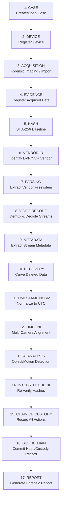

# Drishtik: Data Flow Architecture

> Complete evidence lifecycle and data flow specification.
> All data transformations must follow the flow described in this document.

---

## 1. Master Evidence Lifecycle



---

## 2. Detailed Stage Descriptions

### Stage 1: Case
- Investigator creates a new case or opens an existing case from the Case Manager.
- Case record is created in the database with unique case ID, case name, creation timestamp, and owning admin user.
- First case creation prompts admin account setup.

### Stage 2: Device Registration
- A physical or virtual evidence source is registered.
- **Device is NOT evidence** — it is the origin/container of evidence.
- Device types: DVR, NVR, internal storage, external storage, forensic disk image, other authorized source.
- Device metadata: manufacturer, model, serial number (if available), firmware (if available), channels, storage type, detection method, confidence level, warnings.
- Device identification must never fabricate vendor/model claims unsupported by evidence.

### Stage 3: Acquisition
- Forensic data is safely obtained from the authorized source.
- Acquisition creates a forensic copy or image where appropriate.
- Original evidence must not be unnecessarily modified.
- Acquisition is a **long-running job** (runs asynchronously via the Job Orchestrator).
- Records: source path, destination path, acquisition method, start/end time, status, errors, SHA-256.
- Every acquisition operation is auditable.

### Stage 4: Evidence Registration
- Acquired forensic data is registered in the evidence library.
- Each evidence item receives a unique Evidence ID.
- Evidence record captures: file name, source device, source acquisition, file type, file size, import timestamp, original state preservation.
- Evidence is the investigator's working forensic data — derived from but distinct from the physical device.

### Stage 5: Hash Baseline
- SHA-256 hash is computed immediately upon evidence registration.
- MD5 is optionally computed as a secondary reference hash.
- Hash record: evidence ID, algorithm, hash value, computation timestamp.
- This establishes the cryptographic baseline for integrity verification throughout the case.

### Stage 6: Vendor Identification
- The system attempts to identify the DVR/NVR vendor that produced the evidence.
- Identification methods: magic bytes, filesystem signatures, header patterns, container format analysis.
- Result includes: vendor name, confidence score, detection method, warnings.
- **Critical rule**: If identification is inconclusive, the system MUST report "Unknown / Unidentified" — never guess.

### Stage 7: Vendor Parsing
- The appropriate vendor adapter (e.g., DahuaAdapter, HikvisionAdapter) is invoked.
- Adapter extracts the vendor-specific filesystem structure: recording index, channel allocation, block layout.
- If no adapter supports the detected format, return explicit "Unsupported Vendor Format" status.
- Parsing never invents or fabricates file structures.

### Stage 8: Video Decoding
- Extracted video streams are decoded using FFmpeg / FFprobe / OpenCV.
- Supported operations: demuxing, stream identification, frame extraction, codec detection.
- **No re-encoding of original streams** unless creating explicit working copies.
- Original container files remain untouched.

### Stage 9: Metadata Extraction
- Video stream metadata is extracted and stored as derived data.
- Fields: resolution, frame rate, codec, GOP structure, bit rate, duration, channel/camera info, embedded timestamps.
- Metadata is stored separately — never overwrites evidence file properties.

### Stage 10: Recovery
- Deleted file analysis, unallocated space scanning, and file carving on forensic copies.
- Every recovered item is labeled: `RECOVERED EVIDENCE`.
- Recovery records: source evidence, recovery method, recovery status, SHA-256 of recovered data, limitations and caveats.
- Never claim full recovery when only fragments are found.
- Recovery operates ONLY on forensic copies — never on original media.

### Stage 11: Timestamp Normalization
- Original device timestamps are preserved as-is.
- Normalized UTC timestamps are computed and stored as separate fields.
- Original and normalized timestamps coexist — normalization never overwrites originals.
- Handles timezone offsets, clock drift, and device-specific epoch formats.

### Stage 12: Timeline Construction
- Events are aggregated from: video metadata, normalized timestamps, motion detection, AI findings, investigator-created markers, system events.
- Multi-camera alignment by normalized timestamp.
- Supports: camera filter, event type filter, time range filter, event selection, jump-to-video.

### Stage 13: AI Analysis
- Frame processing, motion detection (OpenCV), object detection (YOLO).
- All outputs labeled: `AI-GENERATED FINDING`.
- Stored: timestamp, camera, object class, confidence, frame reference, model version.
- AI results are derived data — never overwrite original evidence metadata.
- Model architecture allows replacement/upgrade of detection models.

### Stage 14: Integrity Verification
- Re-compute SHA-256 of evidence files and compare against baseline hash.
- Result: MATCH (integrity verified) or MISMATCH (integrity alert).
- Hash comparison can confirm binary identity of files.
- **Hash comparison does NOT prove** that two files depict the same physical event or scene.

### Stage 15: Chain of Custody
- Immutable audit trail recording every significant evidence action.
- Event types: imported, acquired, hashed, analyzed, recovered, exported, report_generated, verified, custody_transferred.
- Each event: user ID, timestamp, action, case ID, evidence ID, relevant hash, details.
- Historical custody events cannot be silently modified by normal users.

### Stage 16: Blockchain (Optional)
- If enabled, custody events and hash records are committed to Hyperledger Fabric.
- Data stored on chain: case ID, evidence ID, SHA-256 hash, action, user identity, timestamp, transaction ID.
- **Video/media data is NEVER stored on blockchain.**
- Transaction lifecycle: submitted → committed / failed.
- If blockchain is unavailable, workflow continues using local database only; UI indicates blockchain status.

### Stage 17: Forensic Report
- Comprehensive PDF report generated via ReportLab or WeasyPrint.
- Includes: case summary, evidence inventory, hash verification results, timeline, AI findings (labeled), recovery results (labeled), chain of custody, examiner information.
- Report generation is a long-running job.

---

## 3. Data Separation: Original vs. Derived

```
┌─────────────────────────────┐    ┌─────────────────────────────┐
│     ORIGINAL DATA           │    │     DERIVED DATA            │
│     (Immutable)             │    │     (Stored Separately)     │
├─────────────────────────────┤    ├─────────────────────────────┤
│ • Raw evidence files        │    │ • Normalized timestamps     │
│ • Original timestamps       │    │ • AI detection results      │
│ • Original file metadata    │    │ • Motion detection maps     │
│ • Original hash baselines   │    │ • Extracted frame thumbnails│
│ • Source device records     │    │ • Parsed vendor metadata    │
│ • Acquisition records       │    │ • Recovered file fragments  │
│                             │    │ • Timeline event records    │
│                             │    │ • Investigator annotations  │
│                             │    │ • Generated reports         │
│                             │    │ • Blockchain tx records     │
└─────────────────────────────┘    └─────────────────────────────┘
```

---

## 4. Evidence Hierarchy Model

```
CASE
 ├── case_id (UUID)
 ├── case_name
 ├── created_by (user_id)
 ├── created_at
 └── status
      │
      ├── DEVICE (1:N per case)
      │    ├── device_id (UUID)
      │    ├── device_type (DVR|NVR|INTERNAL_STORAGE|EXTERNAL_STORAGE|FORENSIC_IMAGE|OTHER)
      │    ├── manufacturer
      │    ├── model
      │    ├── serial_number (nullable)
      │    ├── firmware_version (nullable)
      │    ├── channels (nullable)
      │    ├── storage_info
      │    ├── detection_method
      │    ├── detection_confidence
      │    └── warnings (nullable)
      │         │
      │         ├── ACQUISITION (1:N per device)
      │         │    ├── acquisition_id (UUID)
      │         │    ├── source_path
      │         │    ├── destination_path
      │         │    ├── method (PHYSICAL|LOGICAL|IMAGE_IMPORT|FILE_IMPORT)
      │         │    ├── status (QUEUED|RUNNING|COMPLETED|FAILED|CANCELLED)
      │         │    ├── started_at
      │         │    ├── completed_at
      │         │    ├── sha256_hash
      │         │    ├── file_size_bytes
      │         │    └── errors (nullable)
      │         │         │
      │         │         ├── EVIDENCE (1:N per acquisition)
      │         │         │    ├── evidence_id (UUID)
      │         │         │    ├── file_name
      │         │         │    ├── file_path
      │         │         │    ├── file_type
      │         │         │    ├── file_size_bytes
      │         │         │    ├── mime_type
      │         │         │    ├── import_timestamp
      │         │         │    ├── original_timestamps
      │         │         │    ├── processing_status
      │         │         │    ├── evidence_status
      │         │         │    └── source_info
      │         │         │         │
      │         │         │         ├── VIDEO_FILE
      │         │         │         ├── IMAGE_FILE
      │         │         │         ├── VIDEO_METADATA
      │         │         │         └── RECOVERED_DATA
```

---

## 5. API Request Flow (Typical Evidence Import)

```
1. User clicks "Import Evidence" in the frontend
     │
2. Frontend sends POST /api/v1/acquisitions/
     │
3. API layer validates request, checks authentication & RBAC
     │
4. Application service creates Acquisition record (QUEUED)
     │
5. Job Orchestrator schedules background acquisition job
     │
6. API returns job_id immediately (non-blocking)
     │
7. Background worker:
   a. Copies/images source to secure destination
   b. Computes SHA-256 hash
   c. Registers Evidence records
   d. Attempts vendor identification
   e. Updates Acquisition status → COMPLETED
   f. Records chain-of-custody event
   g. Pushes progress via WebSocket
     │
8. Frontend receives WebSocket updates, refreshes UI
```

---

## 6. Cross-Cutting Concerns

### Audit Logging
Every user-initiated and system-initiated action that touches evidence data generates an audit log entry. Audit records are append-only within the local database and (if enabled) mirrored to the blockchain custody layer.

### Error Propagation
Errors in processing engines (parsers, video engine, AI) propagate upward to the service layer as structured result objects containing status codes, error messages, and partial results where applicable. Errors are never silently swallowed.

### Notification Flow
```
Backend Service → Notification record in DB
                → WebSocket push to Frontend
                → Frontend notification tray
```

Notification types: job_completed, job_failed, integrity_alert, blockchain_status, system_warning.
