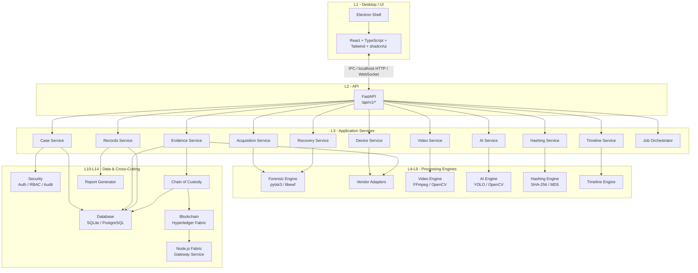

# Drishtik: System Architecture

> Definitive architectural reference for the Drishtik Multi-Vendor DVR/NVR Forensic Analysis Platform.
> All implementation work must conform to this document.

---

## 1. Architectural Principles

1. **Local-First**: All forensic processing runs on the investigator's workstation. No evidence is transmitted to external servers by default.
2. **Immutability of Evidence**: Original evidence files and their metadata are never modified. All derived data (normalized timestamps, AI detections, carved fragments) is stored separately.
3. **Layer Isolation**: Each architectural layer has a single, well-defined responsibility. Layers communicate only through defined interfaces — never through shared mutable state or direct file manipulation across boundaries.
4. **Modular Extensibility**: Vendor parsers, AI models, reporting templates, and blockchain connectors are pluggable adapters behind stable interfaces.
5. **Fail-Explicit**: Every module must return explicit status (success, failure, unsupported, partial) rather than silently guessing or fabricating results.
6. **Security by Default**: Authentication, authorization, input validation, and audit logging are structural requirements — not optional add-ons.

---

## 2. System Layer Architecture

```
┌─────────────────────────────────────────────────────────────────┐
│  L1  DESKTOP / UI LAYER                                        │
│      Electron Shell · React · TypeScript · Tailwind · shadcn/ui│
│      Framer Motion · IPC Bridge                                │
├─────────────────────────────────────────────────────────────────┤
│  L2  API LAYER                                                 │
│      FastAPI REST + WebSocket · Versioned Routes (/api/v1/…)   │
│      Request Validation · Authentication Middleware             │
├─────────────────────────────────────────────────────────────────┤
│  L3  APPLICATION / SERVICE LAYER                               │
│      Case Service · Evidence Service · Device Service           │
│      Acquisition Service · Video Service · Recovery Service     │
│      Timeline Service · AI Service · Hashing Service            │
│      Records Service · Settings Service · Notification Service  │
│      Job Orchestrator                                           │
├─────────────────────────────────────────────────────────────────┤
│  L4  FORENSIC ENGINE                                           │
│      Disk Image Loader · Partition Analyzer · Sector Reader     │
│      Write-Block Enforcer · pytsk3 · libewf                    │
├─────────────────────────────────────────────────────────────────┤
│  L5  VENDOR ADAPTER LAYER                                      │
│      Adapter Interface · DahuaAdapter · HikvisionAdapter        │
│      CPPlusAdapter · UniviewAdapter · GodrejAdapter             │
│      HoneywellAdapter · MatrixAdapter · Future Adapters         │
├─────────────────────────────────────────────────────────────────┤
│  L6  VIDEO PROCESSING LAYER                                    │
│      FFmpeg · FFprobe · OpenCV · Stream Demuxer                 │
│      Frame Extractor · Metadata Parser · Codec Validator        │
├─────────────────────────────────────────────────────────────────┤
│  L7  AI ANALYSIS LAYER                                         │
│      YOLO Inference · OpenCV Motion Detection                   │
│      Model Registry · Confidence Thresholds                    │
│      Result Labeling (AI-GENERATED FINDING)                     │
├─────────────────────────────────────────────────────────────────┤
│  L8  INTEGRITY / HASHING LAYER                                 │
│      SHA-256 Engine (Primary) · MD5 Engine (Reference)          │
│      Hash Comparator · Verification Records                    │
├─────────────────────────────────────────────────────────────────┤
│  L9  TIMELINE LAYER                                            │
│      Timestamp Normalizer · Multi-Camera Aligner                │
│      Event Aggregator · Filter Engine                           │
├─────────────────────────────────────────────────────────────────┤
│  L10 EVIDENCE / CASE DATABASE LAYER                            │
│      SQLAlchemy ORM · SQLite (initial) · PostgreSQL (future)    │
│      Alembic Migrations · Repository Pattern                   │
├─────────────────────────────────────────────────────────────────┤
│  L11 SECURITY LAYER                                            │
│      Authentication · RBAC · Password Hashing (bcrypt/argon2)   │
│      Session Management · Audit Logger · Path Traversal Guard   │
├─────────────────────────────────────────────────────────────────┤
│  L12 CHAIN-OF-CUSTODY LAYER                                    │
│      Custody Event Recorder · Custody Verifier                  │
│      Immutable Event History · Export for Legal Use             │
├─────────────────────────────────────────────────────────────────┤
│  L13 BLOCKCHAIN INTEGRATION LAYER                              │
│      Fabric Gateway Client · Transaction Manager                │
│      Offline Fallback · Verification Queries                   │
│      Node.js/TypeScript Fabric Gateway Service                 │
├─────────────────────────────────────────────────────────────────┤
│  L14 REPORTING LAYER                                           │
│      Report Template Engine · ReportLab / WeasyPrint            │
│      PDF Generator · Evidence Attachment · Hash Inclusion       │
└─────────────────────────────────────────────────────────────────┘
```

---

## 3. Component Diagram



---

## 4. Technology Mapping

| Layer | Module Directory | Primary Technologies |
| :--- | :--- | :--- |
| L1 Desktop/UI | `frontend/` | Electron, React 18+, TypeScript, Tailwind CSS, shadcn/ui, Framer Motion |
| L2 API | `backend/api/` | Python 3.11+, FastAPI, Pydantic, uvicorn |
| L3 Application Services | `backend/services/` | Python, asyncio, background task workers |
| L4 Forensic Engine | `forensic_engine/` | Python, The Sleuth Kit, pytsk3, libewf |
| L5 Vendor Adapters | `parsers/` | Python, per-vendor modules behind common interface |
| L6 Video Processing | `video_engine/` | Python, FFmpeg, FFprobe, OpenCV |
| L7 AI Analysis | `ai_engine/` | Python, YOLO (ultralytics), OpenCV |
| L8 Integrity/Hashing | `hashing/` | Python hashlib (SHA-256, MD5) |
| L9 Timeline | `timeline/` | Python |
| L10 Database | `database/` | SQLAlchemy, Alembic, SQLite (initial), PostgreSQL (future) |
| L11 Security | `security/` | Python, bcrypt/argon2, JWT or session tokens |
| L12 Chain of Custody | `security/custody/` | Python, integrated with L10 and L13 |
| L13 Blockchain | `blockchain/` | Python client, Node.js/TypeScript Fabric Gateway service |
| L14 Reporting | `reports/` | Python, ReportLab or WeasyPrint |
| Testing | `tests/` | pytest, pytest-asyncio, synthetic test data |
| Scripts | `scripts/` | Shell/Python utility scripts |

---

## 5. Module Boundaries & Forbidden Cross-Dependencies

### Strict Boundary Rules

```
frontend/         MUST NOT   import from   backend/, forensic_engine/, parsers/, or any Python module
                  MUST NOT   directly read/write evidence files
                  MUST       communicate exclusively through L2 API

backend/          MUST NOT   import from   frontend/
                  MUST NOT   contain vendor-specific parsing logic (belongs in parsers/)
                  MUST NOT   contain forensic disk access logic (belongs in forensic_engine/)

forensic_engine/  MUST NOT   import from   frontend/ or backend/api/
                  MUST NOT   contain vendor-specific format parsing (belongs in parsers/)
                  MAY        be invoked by backend/services/

parsers/          MUST NOT   import from   frontend/ or backend/api/
                  MUST NOT   import from   ai_engine/ or video_engine/
                  MUST       implement the common VendorAdapter interface from parsers/common/
                  MAY        be invoked by backend/services/

video_engine/     MUST NOT   import from   frontend/
                  MUST NOT   modify original evidence files
                  MAY        be invoked by backend/services/

ai_engine/        MUST NOT   import from   frontend/
                  MUST NOT   overwrite original evidence metadata
                  MUST       label all outputs as AI-GENERATED
                  MAY        be invoked by backend/services/

hashing/          MUST NOT   import from   frontend/
                  MUST       treat SHA-256 as primary, MD5 as optional reference
                  MAY        be invoked by any backend service or engine

recovery/         MUST NOT   import from   frontend/
                  MUST       operate on forensic copies, never originals
                  MUST       label all outputs as RECOVERED
                  MAY        be invoked by backend/services/

blockchain/       MUST NOT   import from   frontend/
                  MUST NOT   store actual video/media data
                  MUST       store only hash/custody records
                  MUST       support offline fallback mode

database/         MUST NOT   import from   frontend/
                  MUST       use SQLAlchemy ORM with Alembic migrations
                  MUST       support SQLite and PostgreSQL

security/         MUST NOT   import from   frontend/
                  MUST       enforce RBAC at the service layer
                  MAY        be invoked by backend/api/ middleware and services

reports/          MUST NOT   import from   frontend/
                  MAY        import from database/ and hashing/

tests/            MAY        import from any module for testing purposes
                  MUST NOT   contain real CCTV evidence
```

---

## 6. Dependency Direction (Strict Unidirectional)

```
┌──────────┐
│ frontend │ ←── user interaction only
└────┬─────┘
     │ HTTP / IPC / WebSocket (never direct imports)
     ▼
┌──────────┐
│ backend  │ ←── API routes, middleware, service orchestration
│  /api    │
└────┬─────┘
     │
     ▼
┌──────────────┐
│   backend    │ ←── business logic, job management
│  /services   │
└──┬───┬───┬───┘
   │   │   │
   ▼   ▼   ▼
┌────────────────────────────────────────────────┐
│  forensic_engine  parsers  video_engine        │
│  ai_engine  recovery  timeline                 │ ←── domain engines
│  hashing  reports  blockchain                  │
└──────────────┬─────────────────────────────────┘
               │
               ▼
┌──────────────────┐
│  database        │ ←── persistence
│  security        │ ←── cross-cutting
└──────────────────┘
```

**Direction Rule**: Dependencies flow downward only. Lower layers must never import from higher layers. The `frontend` layer communicates with `backend/api` exclusively through network protocols (HTTP/WS/IPC), never through Python imports.

---

## 7. Communication Protocols

| From → To | Protocol | Notes |
| :--- | :--- | :--- |
| Electron renderer → FastAPI | HTTP REST over localhost | Primary request/response |
| Electron renderer → FastAPI | WebSocket over localhost | Real-time job progress, notifications |
| Electron main → Electron renderer | Electron IPC (contextBridge) | Window management, native dialogs |
| FastAPI → Fabric Gateway | HTTP REST (localhost) | Blockchain transaction submission/query |
| FastAPI → FFmpeg/FFprobe | subprocess (stdin/stdout) | Video processing commands |
| FastAPI → pytsk3/libewf | Python C bindings (in-process) | Forensic disk image access |

---

## 8. Long-Running Job Architecture

```mermaid
statechart-v2
```

### Job Lifecycle

```
QUEUED → RUNNING → COMPLETED
                  → FAILED
                  → CANCELLED
```

### Job Record Schema (Conceptual)

| Field | Type | Description |
| :--- | :--- | :--- |
| `job_id` | UUID | Unique job identifier |
| `job_type` | Enum | ACQUISITION, HASHING, VIDEO_CONVERT, RECOVERY, AI_ANALYSIS, REPORT_GEN, BLOCKCHAIN_TX |
| `case_id` | UUID FK | Owning case |
| `user_id` | UUID FK | Initiating user |
| `status` | Enum | QUEUED, RUNNING, COMPLETED, FAILED, CANCELLED |
| `progress` | Integer (0-100) | Completion percentage |
| `started_at` | DateTime | Job start timestamp |
| `finished_at` | DateTime | Job completion timestamp |
| `error_message` | Text (nullable) | Error details if FAILED |
| `result_reference` | Text (nullable) | Reference to output (evidence ID, report ID, etc.) |

### Implementation Strategy

- FastAPI `BackgroundTasks` for lightweight jobs.
- Python `asyncio` task pool or `concurrent.futures.ProcessPoolExecutor` for CPU-bound forensic work (hashing, AI inference, carving).
- WebSocket channel for real-time progress push to the frontend.
- Job table in database for persistence across restarts.
- UI must never block while a job is running; all long operations submit a job and return immediately.

---

## 9. Electron Security Architecture

| Security Measure | Requirement |
| :--- | :--- |
| Context Isolation | `contextIsolation: true` — renderer cannot access Node.js APIs directly |
| Node Integration | `nodeIntegration: false` — no `require()` in renderer |
| Sandbox | `sandbox: true` where appropriate |
| Content Security Policy | Restrictive CSP: `default-src 'self'; script-src 'self'; connect-src 'self' http://localhost:*` |
| IPC Validation | All `ipcMain` handlers validate sender origin and message schema |
| Remote Code | Never load or execute untrusted remote scripts |
| File Access | All file access routed through backend API; renderer never touches filesystem directly |
| Preload Scripts | Minimal preload exposing only whitelisted IPC channels via `contextBridge` |

---

## 10. Runtime Modes

### Blockchain Mode
| Mode | Behavior |
| :--- | :--- |
| **Blockchain Enabled** | Custody events are submitted to Hyperledger Fabric via the Node.js Gateway service. Transaction IDs are stored locally after confirmed commit. |
| **Local Database Only** | All custody records are stored exclusively in the local database. UI clearly indicates "Blockchain: Offline / Unavailable". Forensic workflow is fully operational. |

The system must never falsely indicate that a blockchain record was successfully committed when the Fabric network is unreachable. Transaction status must distinguish: `submitted`, `committed`, `failed`.

### Verification Workflow (Future)
```
Current SHA-256 of evidence
  → Query Hyperledger Fabric by evidence ID
  → Retrieve recorded SHA-256 from ledger
  → Compare: MATCH / MISMATCH
  → Record verification result in audit log
```
